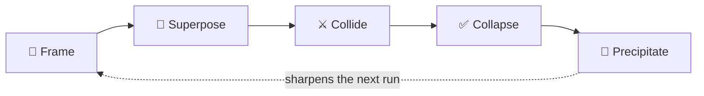

<div align="center">

# ⚛️ PQA — Passionate Quantum Absence

### Breakthrough coding through divergence and verified collapse.

[](https://github.com/aura-farming/pqa/releases)
[](https://github.com/aura-farming/pqa/actions/workflows/ci.yml)
[](LICENSE)


**A Claude Code plugin that refuses the single-pass default.** It holds several genuinely
different solutions in *superposition*, attacks each one, and collapses onto the only
branch that survives attack **and** the tests.

</div>

```text
/plugin marketplace add aura-farming/pqa
/plugin install pqa@pqa-marketplace
```

> No API key needed — PQA runs on your existing Claude Code subscription. Every agent runs on **Opus**.

---

## Why PQA?

The most *probable* answer is the generic one — the average of everything the model has
already seen. PQA bets that the highest-**value** answer usually isn't the most probable:
it lives in the low-probability region a single pass would never reach. So PQA spreads
effort wide, then lets **evidence — not eloquence — decide** what survives.

- **🌌 Divergence, not autocomplete** — branches that differ in *topology* (architecture, data model, control flow), generated blind to each other so they don't converge early.
- **⚔️ Adversarial by default** — every branch is attacked: edge cases, failure modes, security holes, unjustified complexity, broken assumptions.
- **💎 Evidence over eloquence** — the survivor is the branch that passes the real tests and resolves the most attacks. Conviction changes what gets *explored*, never what gets *accepted*.

## The one rule that cannot be broken

> **Nothing reaches a merge without passing the verifier.**
>
> A high-conviction branch that fails its tests is a *recorded failure*, not a shipped
> feature. An unverified coding harness just produces confident wrong code — the opposite
> of useful. CI enforces this invariant; there is no bypass.

## The loop



| Stage | What happens |
|-------|--------------|
| **🔭 Frame** | Load two views — what the docs/research say, and what's true *in this context*. The gap is the first branching axis. |
| **🌌 Superpose** | Spawn N branches (default 3) that differ in *kind*. At least one takes the non-obvious fork. |
| **⚔️ Collide** | The adversary attacks every branch. It breaks them; it does not fix them. |
| **✅ Collapse** | The verifier runs the real tests/types/lint. The survivor passes verification and resolves the most attacks. Ties break toward the bigger swing. |
| **💎 Precipitate** | Name the winner and why it won; record every dead branch and why it died. Next run's frames are sharper for it. |

Run the whole thing with **`/pqa <task>`**, or step through it: `/frame` → `/superpose` → `/collapse` → `/precipitate`.

## What you get

- **34 agents · 59 skills · 27 commands** — every one PQA-native, built for one loop, none generic.
- **Five enforcing hooks** (research gate, security gate, secrets guard, verify loop, precipitate capture) that make **auto mode** safe — they block dangerous ops even when permission prompts are off.
- **Three continuous loops** that compound across runs *and across people*: precipitation (every run persists what won), human learning (`/instinct-export` · `/instinct-import`), and self-understanding (the harness calibrates its own conviction against outcomes).
- **An update notice** — PQA tells you at session start when a newer release is out.

## Install

PQA installs three ways. It's built for **auto mode** (autonomous, classifier-gated); the hooks keep that safe.

**As a plugin (recommended):**
```text
/plugin marketplace add aura-farming/pqa
/plugin install pqa@pqa-marketplace
```

**Manually — project-level** (just this repo):
```bash
git clone https://github.com/aura-farming/pqa.git && cd pqa
./scripts/install.sh project      # installs into ./.claude
```

**Manually — system-level** (all your projects):
```bash
./scripts/install.sh system       # installs into ~/.claude
```

Then open Claude Code and run `/pqa <task>`.

## The loop, in commands

`/baseline` captures the single-pass result so you can measure the difference. `/spiral`
goes another round. `/eval` benchmarks PQA against the baseline over time. Learning is
portable: `/instinct-status` shows what PQA has learned (with confidence), `/evolve`
clusters instincts into skills, and `/dashboard` renders the accumulating moat.

## Configuration

PQA reads runtime settings from `pqa-config.toml` and/or `PQA_*` environment variables
(precedence: **env > TOML > defaults**). The loader is stdlib-only (`tomllib`), strictly
typed, and rejects wrong-typed values, unknown keys, non-finite budgets, and `memory_db`
paths into system directories. See [`pqa-config.example.toml`](pqa-config.example.toml)
for the full schema.

## Updating

Releases are listed in [CHANGELOG.md](CHANGELOG.md) and published as
[GitHub Releases](https://github.com/aura-farming/pqa/releases) — and PQA shows an update
banner at session start when you're behind.

- **Plugin install:** update through Claude Code's `/plugin` flow (re-sync `pqa-marketplace`).
- **Manual install:** re-run the installer — copied hooks don't auto-update:
  ```bash
  git pull && ./scripts/install.sh project   # or: system
  ```

## How it's built

Python 3.14 (stdlib-only harness core) · `uv` + `pyproject.toml` · Claude Code plugin
(agents / skills / commands / hooks + `.claude-plugin/` manifests) · git worktrees for
parallel branches · SQLite (WAL) for memory · `ruff` / `pyright --strict` / `pytest` +
mutation testing as the collapse gate. Four CI workflows gate every change.

## Status

**Phase 0.** The engine core — frame, superpose, collide, collapse, precipitate, the
cost governor, and the memory store — is implemented and CI-gated: **300+ tests, 95%+
coverage**, the verifier-invariant gate and hook smoke tests green, instinct
export/import working, the full 34 / 59 / 27 component catalog generated.
**Next:** true git-worktree parallelization of branches.

## License

[MIT](LICENSE).
