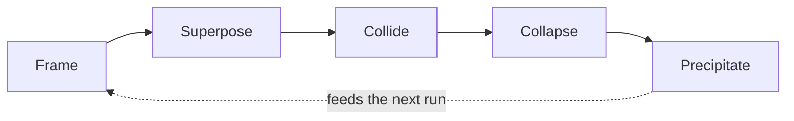

# PQA — Passionate Quantum Absence

[](https://github.com/aura-farming/pqa/releases)
[](https://github.com/aura-farming/pqa/actions/workflows/ci.yml)
[](LICENSE)


**Structured test-time compute for code, with a hard verifier gate.** PQA generates *N*
topologically-distinct solutions to a task, has an adversary attack each, and ships only
the branch that passes an executable verifier — tests, types, lint. The model's first,
most-probable completion is never the default winner.

`superposition → collision → collapse` is best-of-*N* with **enforced diversity**,
**adversarial critique**, and **verification-gated selection**. It's a Claude Code plugin;
it runs on your subscription (every agent on Opus), no API key.

```text
/plugin marketplace add aura-farming/pqa
/plugin install pqa@pqa-marketplace
```

## The idea

A single pass returns the highest-*probability* completion — by construction, the generic
one. PQA spends test-time compute to reach solutions a single pass won't, then resolves
them on evidence rather than fluency:

- **Diversity is enforced, not hoped for.** Branches must differ in *topology* —
  architecture, data model, control flow — and are generated blind to each other, so they
  don't converge on one answer wearing different variable names.
- **Critique is a separate adversary pass.** Each branch is attacked for edge cases,
  failure modes, security, and unjustified complexity. The adversary breaks; it never fixes.
- **Selection is gated on an executable verifier.** The survivor is the branch that passes
  the real suite and resolves the most attacks — decided by `pytest` / types / lint, not by
  a reward model or the model's own judgement. No suite? The result is flagged `UNVERIFIED`.

The one invariant: **selection is gated on the verifier.** Conviction, elegance, and "it
feels right" change what gets *explored*, never what gets *accepted*. A high-conviction
branch that fails its tests is a recorded failure, not a shipped feature. CI enforces this;
there is no bypass.

## How it relates to what you already know

| Technique | PQA's relation |
|-----------|----------------|
| **Best-of-*N* / sampling** | This is best-of-*N* — but diversity is enforced at the topology level rather than left to temperature, and candidates are generated blind. |
| **Self-consistency** | Same "sample many, pick one" shape; the selector is an executable verifier, not a majority vote. |
| **LLM debate / critique** | The adversary is a dedicated critic pass — but it only *attacks*. It never decides the winner. |
| **Verifier / reward models** | The gate is a real test suite, grounded in execution rather than a learned proxy. A failing gate is final. |
| **Reflexion / self-refine** | PQA records why each dead branch died and feeds it forward — but self-assessment never overrides the suite. |

## The loop



| Stage | Mechanism |
|-------|-----------|
| **Frame** | Load a research view and an in-context self-eval view; their disagreement is the first branching axis. |
| **Superpose** | Generate *N* candidates (default 3), topology-diverse and blind, with at least one forced onto the non-obvious fork. |
| **Collide** | The adversary attacks every candidate — edge cases, failure modes, security, complexity. |
| **Collapse** | The verifier runs the real tests/types/lint. The survivor passes verification and resolves the most findings; ties break toward the less incremental branch. |
| **Precipitate** | Name the winner and why it won; record each dead branch and why it died — so the next run's frames are sharper. |

`/pqa <task>` runs the whole loop; `/frame → /superpose → /collapse → /precipitate` steps through it.

## Measure it yourself

The claims are meant to be falsifiable. `/baseline` captures the single-pass result for a
task; `/eval` benchmarks PQA against that baseline over time. If PQA doesn't beat
single-pass on your work, the harness will show you.

## What's in the box

- **34 agents · 59 skills · 27 commands** — purpose-built for the loop, not a generic pack.
- **Five enforcing hooks** (research gate, security gate, secrets guard, verify loop,
  precipitate capture) that keep autonomous *auto mode* safe: they block dangerous ops
  even when permission prompts are off.
- **Continuous learning** — named precipitates persist across runs; instincts export and
  import across people (`/instinct-export`, `/instinct-import`).
- **Update notice** at session start when a newer release is out.

## Install

```text
# Plugin (recommended)
/plugin marketplace add aura-farming/pqa
/plugin install pqa@pqa-marketplace
```

```bash
# Manual — project-level (this repo) or system-level (all projects)
git clone https://github.com/aura-farming/pqa.git && cd pqa
./scripts/install.sh project      # or: system
```

Then run `/pqa <task>`. No API key — PQA uses your Claude Code subscription.

## Configuration

Settings come from `pqa-config.toml` and/or `PQA_*` environment variables (precedence:
**env > TOML > defaults**). The loader is stdlib-only (`tomllib`), strictly typed, and
rejects wrong-typed values, unknown keys, non-finite budgets, and `memory_db` paths into
system directories. See [`pqa-config.example.toml`](pqa-config.example.toml).

## Built with · status

Python 3.14 stdlib-only core · `uv` · `ruff` · `pyright --strict` · `pytest` + mutation
testing as the collapse gate · SQLite for memory · four CI workflows.

**Phase 0.** The engine — frame, superpose, collide, collapse, precipitate, the cost
governor, and the memory store — is implemented and CI-gated: 300+ tests, 95%+ coverage,
the verifier-invariant gate and hook smoke tests green. Branches currently run in-context
and sequentially; **next** is true git-worktree parallelization behind the same interface.

## Updating

Releases are in [CHANGELOG.md](CHANGELOG.md) and published as
[GitHub Releases](https://github.com/aura-farming/pqa/releases); PQA also shows a banner at
session start when you're behind. Plugin installs update via `/plugin`; manual installs
re-run `./scripts/install.sh` (copied hooks don't auto-update).

## License

[MIT](LICENSE).
